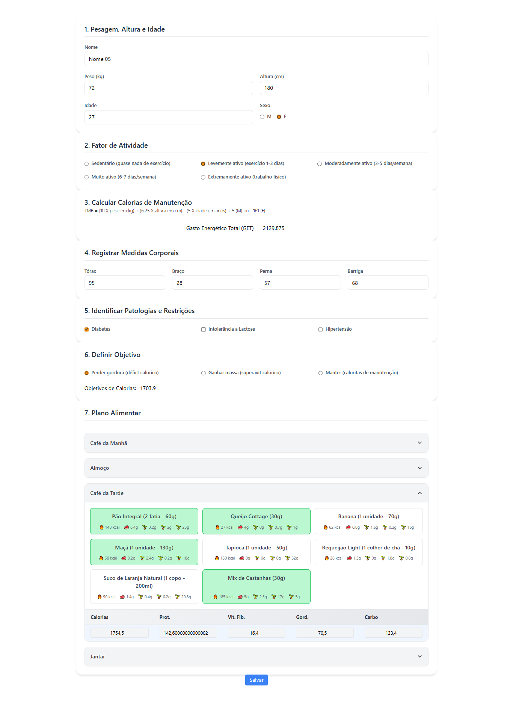
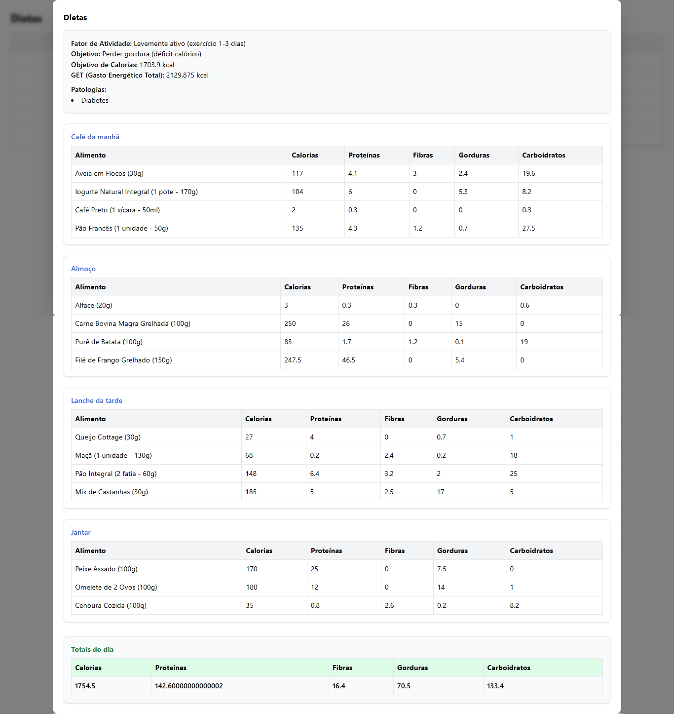

# NutriFlow - Gerenciamento de Planos Alimentares

Este projeto tem como objetivo **criar, gerenciar e visualizar dietas personalizadas**.  
Ele permite cadastrar informações pessoais, restrições, patologias e montar refeições com alimentos e valores nutricionais.  

---

## 🚀 Tecnologias Utilizadas

- **Frontend:** React + TailwindCSS  
- **Backend:** Node.js + Express  
- **Banco de Dados:** Sequelize + SQLite  

---

## 📌 Funcionalidades

- Cadastro de **info pessoais** (nome, peso, idade, sexo).  
- Definição de **fator de atividade**.  
- Registro de **patologias** e restrições alimentares.  
- Definição de **objetivo nutricional** (ex.: perda de gordura, manutenção, ganho de massa).  
- Criação de dietas com **refeições agrupadas** (café da manhã, almoço, lanche, jantar, ceia).  
- Visualização detalhada da dieta em **tabelas de nutrientes** (calorias, proteínas, fibras, gorduras e carboidratos).  
- Cálculo de **totais diários** de nutrientes.  

---

## Fluxo do Sistema

---

## 🍽️ Exemplo de Dieta Montada

## 📌 Próximos Passos

- Implementar autenticação (JWT).
- Melhorar UI com gráficos de evolução.
- Exportar relatórios em PDF.